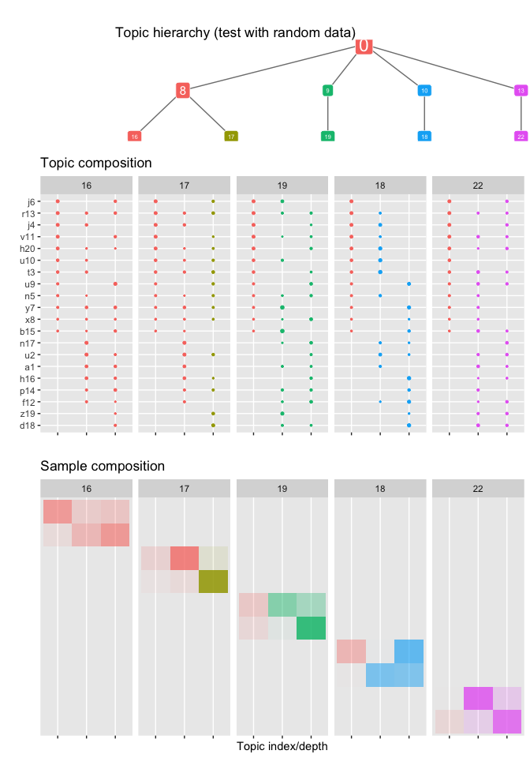

<!-- README.md is generated from README.Rmd. Please edit that file -->

# hLDA

<!-- badges: start -->

<!-- badges: end -->

The `hLDA` package is a wrapper around the `HLDA` class/functions of the
`tomotopy` `python` library. It allows to fit hierarchical topic models
(hierarchical Latent Dirichlet Allocation) on matrix of count data where
each row is a sample (e.g. a document) and each column is a feature
(e.g. a word). Element `(i,j)` of the count matrix provides the number
of time a given feature `j` was found in document `i`.

## Installation

You can install the development version of hLDA like so:

``` r
# FILL THIS IN! HOW CAN PEOPLE INSTALL YOUR DEV PACKAGE?
```

## Example

This is a basic example which shows you how to fit a hierarchical LDA
model to count data and to visualized the fitted parameters. This
example fit hLDA to random data, where no structure is expected.

``` r
library(hLDA)
#> Warning: replacing previous import 'dplyr::union' by 'igraph::union' when
#> loading 'hLDA'
#> Warning: replacing previous import 'dplyr::as_data_frame' by
#> 'igraph::as_data_frame' when loading 'hLDA'
#> Warning: replacing previous import 'dplyr::groups' by 'igraph::groups' when
#> loading 'hLDA'

set.seed(1)
M <- 10 # number of samples (e.g. documents)
N <- 20 # number of features (e.g. words)
x <- matrix(sample(0:100, N*M, replace = TRUE), M, N)
colnames(x) <- paste0(sample(letters, N, replace = TRUE), 1:N) # random feature names
m <- hLDA(x, depth = 3) # fitting the hLDA to the data
```

``` r

plot_hLDA(m, title = "test with random data")
```


